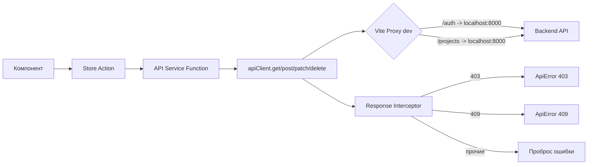

# API-интеграция

> HTTP-клиент на Axios с перехватчиками ответов, единой обработкой ошибок и набором сервисных функций для всех эндпоинтов backend.

## Расположение в репозитории

- `src/api/client.js` — Axios-клиент, interceptor, фабрика `api`, health-check
- `src/api/auth.js` — Эндпоинты аутентификации
- `src/api/projects.js` — Эндпоинты проектов, источников, таблиц, колонок, РПИ-маппингов
- `src/api/layerMapping.js` — Эндпоинты DWH-таблиц, маппингов слоёв, lineage
- `src/composables/useApiStatus.js` — Composable для мониторинга доступности API

## Как устроено

### HTTP-клиент

`src/api/client.js` создаёт экземпляр Axios с:

- `baseURL`: пустая строка в dev-режиме (Vite proxy), `VITE_API_BASE_URL` в production
- `withCredentials: true` — отправка httpOnly cookies с каждым запросом
- `Content-Type: application/json` по умолчанию



### Фабрика api

Объект `api` оборачивает методы Axios и автоматически возвращает `response.data`:

```javascript
export const api = {
  get:    (url, config) => apiClient.get(url, config).then((r) => r.data),
  post:   (url, data, config) => apiClient.post(url, data, config).then((r) => r.data),
  put:    (url, data, config) => apiClient.put(url, data, config).then((r) => r.data),
  patch:  (url, data, config) => apiClient.patch(url, data, config).then((r) => r.data),
  delete: (url, config) => apiClient.delete(url, config).then((r) => r.data),
};
```

### Обработка ошибок

**Response interceptor** (глобальный):
- 403 → `ApiError(403, 'Нет прав доступа')`
- 409 → `ApiError(409, 'Ресурс уже существует')`
- остальные статусы пробрасываются как есть

**Локальная обработка** (в каждом store через `handleApiError`):
- 401 → вызов `authStore.logout()`, редирект на /login
- 403/409/422 → установка соответствующего сообщения в error ref
- 500+ → сообщение "Сервер недоступен, попробуйте позже"
- 422 → дополнительно извлекаются field-errors

### Health-check

`isApiAvailable()` — GET `/health` с timeout 5s. Используется в `useApiStatus` composable для мониторинга.

## Ключевые сущности

| Сущность | Файл | Назначение |
|----------|------|------------|
| `apiClient` | `client.js:20` | Инстанс Axios |
| `ApiError` | `client.js:3` | Класс ошибки со status и message |
| `api` | `client.js:61` | Фабрика методов (get/post/put/patch/delete) |
| `isApiAvailable()` | `client.js:49` | Health-check |
| `ProjectsApi` | `projects.js:173` | Все эндпоинты проектов и связанных сущностей |
| `LayerMappingApi` | `layerMapping.js:151` | Эндпоинты DWH и lineage |
| `useApiStatus` | `composables/useApiStatus.js` | Мониторинг подключения |

## Связи с другими доменами

- [auth.md](auth.md) — использует `apiClient` с cookies
- [projects.md](projects.md) — использует `ProjectsApi`
- [layer-mapping.md](layer-mapping.md) — использует `LayerMappingApi`
- [config.md](config.md) — Vite proxy для dev-режима
- [tables.md](tables.md) — использует API функций таблиц/колонок

## Нюансы и ограничения

- В dev-режиме Vite проксирует запросы на `localhost:8000` — это решает проблему CORS
- `withCredentials: true` обязателен для работы cookie-аутентификации
- Нет request-интерсепторов — все auth-заголовки отсутствуют (т.к. используются cookies)
- Нет автоматической обработки 401 в глобальном interceptor — каждый store обрабатывает 401 самостоятельно
- Только текстовое логирование ошибок в console.warn
