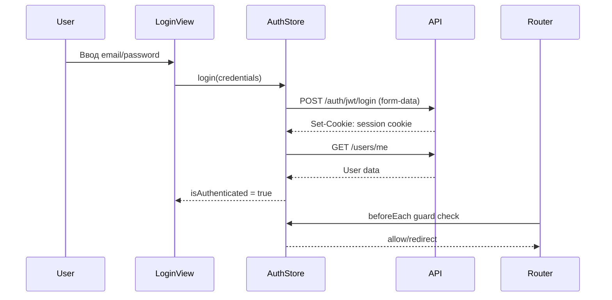

# Аутентификация и авторизация

> Обеспечивает аутентификацию пользователей через JWT-токены в httpOnly cookies и защиту маршрутов на основе сессии.

## Расположение в репозитории

- `src/api/auth.js` — API-функции (login, register, getMe, logout)
- `src/stores/auth.js` — Pinia store с состоянием пользователя
- `src/router/index.js` — глобальный navigation guard
- `src/views/LoginView.vue` — страница входа
- `src/views/RegisterView.vue` — страница регистрации
- `src/main.js` — инициализация auth при старте приложения

## Как устроено

Аутентификация реализована на JWT-токенах, которые backend устанавливает через `Set-Cookie` (httpOnly, не доступны из JS). Frontend не хранит токены в localStorage — это исключает XSS-атаки на токены.



### Маршрутные защитники

В `src/router/index.js` определён глобальный `beforeEach` guard:

- Публичные маршруты (`/login`, `/register`) — доступны без аутентификации; авторизованный пользователь перенаправляется на Home
- Все остальные маршруты — требуют `requiresAuth: true`; неавторизованный пользователь перенаправляется на `/login` с query-параметром `redirect`
- Guard ожидает инициализации authStore (вызов `loadUser()`), чтобы избежать race condition

### Инициализация приложения

В `src/main.js` выполняется `await Promise.all([router.isReady(), authStore.loadUser()])` перед монтированием приложения. Это гарантирует, что:

1. Маршрутизатор готов к навигации
2. Состояние аутентификации загружено (проверен `/users/me`)
3. Компонент `App.vue` показывает спиннер, пока `authStore.isInitialized === false`

## Ключевые сущности

| Сущность | Файл | Назначение |
|----------|------|------------|
| `login()` | `src/api/auth.js:3` | POST /auth/jwt/login с form-data (username, password, grant_type) |
| `register()` | `src/api/auth.js:15` | POST /auth/register с JSON (email, password, full_name) |
| `getMe()` | `src/api/auth.js:20` | GET /users/me — проверка текущей сессии |
| `logout()` | `src/api/auth.js:24` | POST /auth/logout — очистка cookie |
| `useAuthStore` | `src/stores/auth.js:4` | Pinia store с user, isAuthenticated, isInitialized |
| `createAppRouter()` | `src/router/index.js:19` | Фабрика роутера с guards |

## Как использовать / запустить

```javascript
import { useAuthStore } from '@/stores/auth';

const authStore = useAuthStore();

// Логин
await authStore.login({ username: 'user@example.com', password: 'pass' });

// Проверка статуса
if (authStore.isAuthenticated) {
  console.log(authStore.user.full_name);
}

// Выход
await authStore.logout(); // редирект на /login
```

## Связи с другими доменами

- [api.md](api.md) — API использует `apiClient` с `withCredentials: true` для отправки cookies
- [ui.md](ui.md) — `AppTopbar.vue` использует auth store для отображения имени пользователя и кнопки выхода
- [config.md](config.md) — Vite proxy настраивает перенаправление `/auth` на backend

## Нюансы и ограничения

- При старте приложения выполняется `localStorage.removeItem('access_token')` — это удаляет legacy токены, если они остались от предыдущей версии
- Ошибка 401 не обрабатывается глобально в interceptor — только через error-хендлеры в конкретных stores
- Frontend НЕ обрабатывает refresh-токены — предполагается, что backend устанавливает cookie с достаточным сроком жизни
