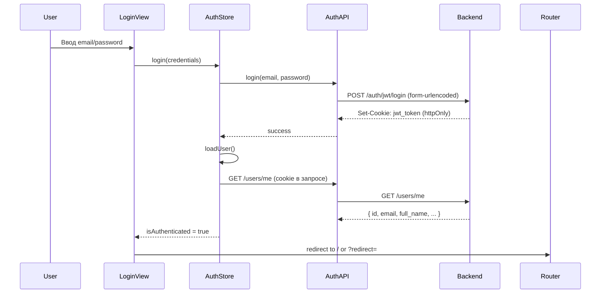

# Аутентификация и авторизация

> Обеспечивает аутентификацию пользователей через JWT-токены в httpOnly-cookie, маршрутные защитники и управление состоянием сессии.

## Расположение в репозитории

- `src/api/auth.js` — API-методы (login, register, getMe, logout)
- `src/api/client.js` — Axios-клиент с `withCredentials: true`
- `src/stores/auth.js` — Pinia-стор состояния аутентификации
- `src/router/index.js` — Route guards (navigation guards)
- `src/views/LoginView.vue` — Страница входа
- `src/views/RegisterView.vue` — Страница регистрации

## Как устроено

### Схема потока аутентификации



### Основные принципы

- **JWT в httpOnly cookie** — токен передаётся и хранится исключительно на сервере через `Set-Cookie`. Клиент никогда не записывает `access_token` в `localStorage`.
- **`withCredentials: true`** — Axios-клиент сконфигурирован на отправку cookies в каждом запросе (`src/api/client.js:13`).
- **Ленивая инициализация** — при загрузке приложения `main.js` вызывает `authStore.loadUser()` до монтирования корневого компонента.
- **Route guards** — `router.beforeEach` проверяет `authStore.isAuthenticated` и редиректит на `/login` для защищённых маршрутов.

## Ключевые сущности

### Auth Store (`src/stores/auth.js`)

| Свойство | Тип | Описание |
|----------|-----|----------|
| `user` | `Object\|null` | Данные пользователя с сервера |
| `isAuthenticated` | `boolean` | Флаг аутентификации |
| `isInitialized` | `boolean` | Флаг завершения инициализации |
| `_loadingPromise` | `Promise\|null` | Защита от повторных вызовов `loadUser()` |

### API-методы (`src/api/auth.js`)

| Функция | Эндпоинт | Метод | Особенности |
|---------|----------|-------|-------------|
| `login` | `/auth/jwt/login` | POST | `Content-Type: application/x-www-form-urlencoded` |
| `register` | `/auth/register` | POST | Принимает `{ email, full_name, password }` |
| `getMe` | `/users/me` | GET | Возвращает данные текущего пользователя |
| `logout` | `/auth/logout` | POST | Очищает cookie на сервере |

### Маршрутные защитники (`src/router/index.js:89-110`)

- **Публичные маршруты**: `/login`, `/register` — доступны без аутентификации; авторизованные пользователи редиректятся на `/`.
- **Защищённые маршруты**: все остальные — редирект на `/login?redirect=...`.
- Асинхронная проверка: если `isInitialized === false`, guard ждёт `authStore.loadUser()`.

## Как использовать / запустить

```javascript
import { useAuthStore } from '@/stores/auth';

// Вход
const authStore = useAuthStore();
await authStore.login({ username: 'user@example.com', password: 'secret' });

// Проверка статуса
if (authStore.isAuthenticated) {
  console.log(authStore.user.full_name);
}

// Выход
await authStore.logout();
```

## Связи с другими доменами

- [api.md](api.md) — HTTP-клиент с перехватчиком 401 и конфигурацией `withCredentials`
- [ui.md](ui.md) — `AppTopbar.vue` отображает имя пользователя и кнопку выхода
- [config.md](config.md) — `VITE_API_BASE_URL` определяет адрес backend-сервера с аутентификацией

## Нюансы и ограничения

- При `401` ошибке от API не происходит автоматического редиректа — обработка оставлена на стороне стора (`handleApiError` в stores).
- `window.location.href = "/login"` используется вместо роутера при logout, чтобы гарантированно сбросить всё состояние.
- В `main.js` удаляется `localStorage.removeItem("access_token")` — для обратной совместимости, если ранее использовался `access_token`.
