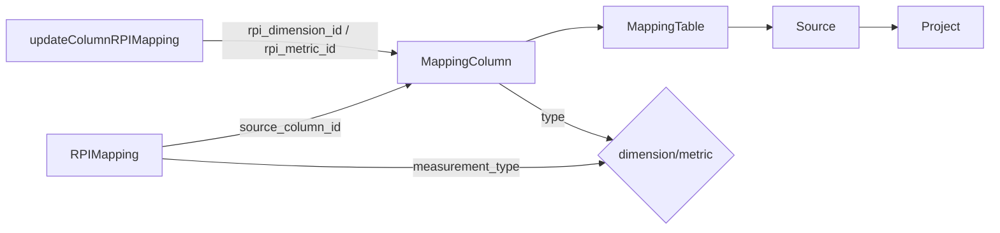

# РПИ-маппинги

> Основная бизнес-логика приложения: управление регуляторными показателями (РПИ), их связь с колонками источников, валидация целостности, фильтрация и пагинация.

## Расположение в репозитории

- `src/stores/rpiMappings.js` — Pinia-стор для CRUD РПИ-маппингов и валидации
- `src/composables/useRPIFilters.js` — Фильтрация, поиск, пагинация РПИ-записей
- `src/composables/useRPIMappingForm.js` — Управление формой добавления/редактирования РПИ
- `src/views/RPIMappingView.vue` — Основная страница управления РПИ
- `src/components/rpi/RPIMappingHeader.vue` — Заголовок страницы
- `src/components/rpi/RPIMappingToolbar.vue` — Панель фильтров
- `src/components/rpi/RPIMappingTable.vue` — Таблица РПИ-записей
- `src/components/rpi/RPIMappingPanel.vue` — Боковая панель для редактирования
- `src/components/common/CreateRPIMappingDialog.vue` — Диалог создания РПИ
- `src/constants/rpi.js` — Константы: статусы, принадлежность, типы измерений, начальная форма
- `src/utils/mapping.js` — Чистые хелперы для работы с маппингом

## Как устроено

### Сущность RPIMapping

```javascript
{
  id: number,                    // Уникальный ID
  number: number,                // Номер РПИ
  project_id: number,            // ID проекта
  ownership: string,             // "Аналитика" | "Маркетинг" | "Гео" | "Техническое"
  status: string,                // "draft" | "review" | "approved"
  block: string,                 // Блок
  measurement_type: string,      // "dimension" | "metric"
  is_calculated: boolean,        // Расчётный показатель?
  formula: string|null,          // Формула для расчётных
  measurement: string,           // Наименование показателя
  measurement_description: string, // Описание
  source_report: string,         // Источник отчёта
  object_field: string,          // Поле объекта
  source_column_id: number|null, // ← жёсткая связь с колонкой источника
  date_added: string,
  date_removed: string|null,
  comment: string,
  verification_file: string|null,
  created_at: string,
  updated_at: string,
}
```

### Связь с колонками источников



### Валидация связи (`src/stores/rpiMappings.js:92-143`)

`validateRPIMappingLink` проверяет:
1. Наличие `source_column_id`
2. Существование колонки в mapping tables
3. Соответствие `measurement_type` → `column.type`
4. Соответствие `is_calculated`

### Фильтрация (`src/composables/useRPIFilters.js`)

**Параметры фильтрации:**
- `search` — поиск по `measurement`, `measurement_description`, `object_field`, `source`, `comment`
- `selectedStatus` — `draft` / `review` / `approved`
- `selectedOwnership` — принадлежность
- `selectedMeasurementType` — `dimension` / `metric`
- `selectedCalculatedType` — `basic` / `calculated`
- Клиентская (по умолчанию) или серверная фильтрация (`useServerFilters`)
- Пагинация: `pageFirst`, `pageSize` (по умолчанию 20)

### Форма РПИ (`src/composables/useRPIMappingForm.js`)

`fillFormFromColumn(column)` — ключевой метод, обеспечивающий жёсткую связь:
- Устанавливает `measurement_type` из `column.type`
- Копирует `is_calculated`, `formula`
- Устанавливает `object_field` из `column.name`
- Записывает `source_column_id = column.id`

### RPI Store (`src/stores/rpiMappings.js`)

**Состояние:** `rpiMappings` — `Record<projectId, RPIMapping[]>`

**Геттеры:**
- `getRPIMappingsByProjectId`, `getRPIMappingById`
- `getRPIMappingOptions(projectId)` — опции для селекта (`label: "1. Показатель (поле)"`)
- `validateRPIMappingLink` — валидация целостности

**Actions:** `loadRPIMappings`, `createRPIMapping`, `updateRPIMapping`, `deleteRPIMapping`

### Константы (`src/constants/rpi.js`)

- `RPI_STATUS_OPTIONS` — статусы для фильтрации
- `RPI_OWNERSHIP_OPTIONS` — принадлежности
- `RPI_MEASUREMENT_TYPES` — `["dimension", "metric"]`
- `MEASUREMENT_TYPE_MAP` — маппинг EN ↔ RU
- `createEmptyRPIForm()` — начальное состояние формы

## Как использовать / запустить

```javascript
import { useRPIMappingsStore } from '@/stores/rpiMappings';
import { useRPIFilters } from '@/composables/useRPIFilters';
import { useRPIMappingForm } from '@/composables/useRPIMappingForm';

const rpiStore = useRPIMappingsStore();
await rpiStore.loadRPIMappings(projectId);

const { filteredRows, paginatedRows, search, resetFilters } = useRPIFilters(rows);
const { form, openAddPanel, saveRule, fillFormFromColumn } = useRPIMappingForm(rows, rpiStore, projectId);
```

## Связи с другими доменами

- [sources.md](sources.md) — РПИ линкуются к колонкам через `source_column_id`; `updateColumnRPIMapping` обновляет связь с таблицами
- [projects.md](projects.md) — `loadProjectData` загружает РПИ-маппинги как часть данных проекта
- [workflow.md](workflow.md) — первый шаг воркфлоу — это форма РПИ (`RPI_FORM`)
- [api.md](api.md) — все операции через API-слой
- [ui.md](ui.md) — компоненты RPIMappingHeader, RPIMappingToolbar, RPIMappingTable, RPIMappingPanel

## Нюансы и ограничения

- `validateRPIMappingLink` принимает объект с `source_column_id`, `measurement_type`, `is_calculated`, но не использует `projectId` для поиска таблиц — требуется внешний store.
- В `src/utils/mapping.js` дублируется логика поиска колонок и источников, которая уже есть в stores.
- Форма РПИ содержит 17 полей — это крупнейшая форма в приложении.
- `CRUD-операции` распространяются на все ключи `rpiMappings` (Object.keys) — потенциально могут затронуть несколько проектов.
