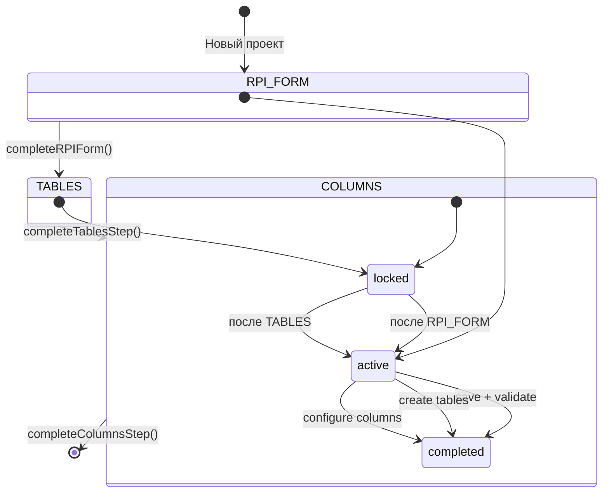

# Воркфлоу процесса

> Пошаговый процесс создания РПИ и связанных сущностей с блокировкой доступа к проекту до завершения обязательных шагов.

## Расположение в репозитории

- `src/stores/workflow.js` — Pinia-стор состояния воркфлоу с localStorage-персистентностью
- `src/components/workflow/StepIndicator.vue` — Визуальный индикатор шагов
- `src/constants/workflow.js` — Константы шагов, статусов, типов колонок

## Как устроено

### Схема шагов



### Константы шагов (`src/constants/workflow.js`)

```javascript
WORKFLOW_STEPS = { RPI_FORM: "rpi_form", TABLES: "tables", COLUMNS: "columns" };
STEP_ORDER = ["rpi_form", "tables", "columns"];
STEP_STATUS = { LOCKED: "locked", ACTIVE: "active", COMPLETED: "completed" };
```

### Workflow Store (`src/stores/workflow.js`)

**Структура состояния (на проект):**
```javascript
{
  projectId: number,
  steps: {
    [WORKFLOW_STEPS.RPI_FORM]: { status, completedAt, data },
    [WORKFLOW_STEPS.TABLES]:   { status, completedAt, data },
    [WORKFLOW_STEPS.COLUMNS]:  { status, completedAt, data },
  },
  isProjectLocked: true,        // Доступ к проекту заблокирован
  rpiEntityId: null,            // ID сохранённой РПИ
  isSubmitting: false,          // Защита от повторных отправок
  validationError: null,        // Последняя ошибка валидации
  updatedAt: Date.now(),
}
```

**Логика переходов:**

1. **Начальное состояние:** `RPI_FORM` активен, `TABLES` и `COLUMNS` заблокированы, проект заблокирован.
2. **`completeRPIForm(projectId, rpiData)`**
   - Бизнес-правила: не активен → ошибка; уже отправляется → ошибка; нет `rpiData.name` → ошибка.
   - Устанавливает `rpiEntityId`, разблокирует проект, активирует шаг `TABLES`.
3. **`completeTablesStep(projectId, tablesData)`**
   - Бизнес-правила: РПИ не сохранена → ошибка; шаг не активен → ошибка; нет таблиц → ошибка.
   - Активирует шаг `COLUMNS`.
4. **`completeColumnsStep(projectId, columnsData)`**
   - Бизнес-правила: таблицы не созданы → ошибка.
   - Завершает воркфлоу.

**Персистентность:** состояние сохраняется в `localStorage` под ключом `workflow_{projectId}`.

### Типы колонок (`src/constants/workflow.js`)

```javascript
COLUMN_TYPES: { METRIC: "metric", DIMENSION: "dimension" };
COLUMN_TYPE_LABELS: { metric: "Показатель", dimension: "Измерение" };
COLUMN_TYPE_COLORS: { metric: { bg: "bg-blue-50", badge: "info" }, dimension: { bg: "bg-green-50", badge: "success" } };
```

## Ключевые сущности

- **`useWorkflowStore`** — управление воркфлоу
- **`StepIndicator.vue`** — UI-компонент отображения шагов
- **`WORKFLOW_STEPS`** — enum шагов
- **`STEP_STATUS`** — enum статусов шага
- **`STEP_ORDER`** — порядок шагов для итерации

## Как использовать / запустить

```javascript
import { useWorkflowStore } from '@/stores/workflow';

const workflowStore = useWorkflowStore();

// Инициализация
workflowStore.initializeWorkflow(projectId);

// Проверка статуса
const isUnlocked = workflowStore.isProjectUnlocked(projectId);
const currentStep = workflowStore.getCurrentStep(projectId);

// Завершение шагов
workflowStore.completeRPIForm(projectId, { name: 'РПИ-001', ... });
workflowStore.completeTablesStep(projectId, { tables: [...] });
workflowStore.completeColumnsStep(projectId, { columns: [...] });

// Сброс
workflowStore.resetWorkflow(projectId);
```

## Связи с другими доменами

- [projects.md](projects.md) — воркфлоу блокирует доступ к проекту (`isProjectLocked`)
- [rpi-mappings.md](rpi-mappings.md) — первый шаг (`RPI_FORM`) связан с созданием РПИ
- [sources.md](sources.md) — шаги `TABLES` и `COLUMNS` связаны с таблицами маппинга
- [ui.md](ui.md) — `StepIndicator.vue` отображает прогресс воркфлоу

## Нюансы и ограничения

- `rpiEntityId` генерируется через `Date.now()` — это имитация; в реальности должен приходить ID от сервера.
- Нет фактических API-вызовов в сторе воркфлоу — все операции локальные (localStorage). API-вызовы должны быть добавлены при интеграции с бэкендом.
- Валидация только на уровне JS — нет синхронизации с серверными ошибками.
- При удалении `localStorage` (очистка кэша) воркфлоу сбрасывается к начальному состоянию.
