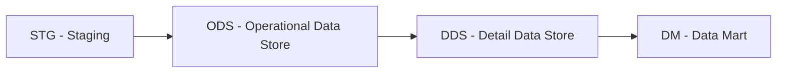
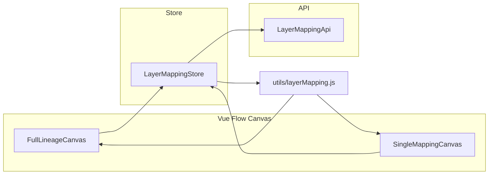

# DWH-слои и lineage

> Управление DWH-таблицами, маппингами между слоями данных (STG → ODS → DDS → DM) и визуализация lineage-графов через Vue Flow.

## Расположение в репозитории

- `src/api/layerMapping.js` — API-функции: DWH-таблицы, DWH-колонки, layer-mappings, lineage
- `src/stores/layerMapping.js` — Pinia store: состояние, CRUD, lineage-данные, single/full режимы
- `src/utils/layerMapping.js` — Константы слоёв, цвета, функции преобразования для Vue Flow
- `src/composables/useLayerMappingCanvas.js` — Управление Vue Flow canvas (zoom, fitView, edge click)
- `src/composables/useLayerMappingForm.js` — Форма трансформации маппинга
- `src/views/LayerMappingView.vue` — Страница маппинга слоёв
- `src/components/layerMapping/` — Компоненты: ERTableNode, FullLineageCanvas, SingleMappingCanvas, TransformationModal, CreateDWHTableDialog, LayerMappingToolbar

## Как устроено

### Слои данных

Система поддерживает 4 стандартных DWH-слоя:



| Слой | Описание | Цвет | Иконка |
|------|----------|------|--------|
| `stg` | Staging — сырые данные из источников | Синий | `pi-inbox` |
| `ods` | Operational Data Store — операционный слой | Зелёный | `pi-database` |
| `dds` | Detail Data Store — детальное хранилище | Фиолетовый | `pi-table` |
| `dm` | Data Mart — витрины данных | Янтарный | `pi-chart-bar` |

### Режимы отображения

- **Single Mapping** — просмотр одного маппинга (source → target + transformation/algorithm)
- **Full Lineage** — полный граф всех связей между слоями

### Данные для canvas

API возвращает lineage в формате `{ nodes: [], edges: [] }`. Функция `lineageToFlowData()` преобразует их в формат Vue Flow:

- **Nodes** позиционируются по слою (X = колонка слоя) и индексу внутри слоя (Y)
- **Edges** — анимированные линии с данными transformation/algorithm
- Кастомная нода `ERTableNode` отображает таблицу с колонками



## Ключевые сущности

| Сущность | Файл | Назначение |
|----------|------|------------|
| `useLayerMappingStore` | `stores/layerMapping.js:64` | Store: DWH-таблицы, маппинги, lineage, режимы |
| `loadLineage(projectId)` | `stores/layerMapping.js:203` | Загрузка полного графа lineage |
| `loadTables(projectId)` | `stores/layerMapping.js:365` | Загрузка DWH-таблиц |
| `loadMappings(projectId, params)` | `stores/layerMapping.js:222` | Загрузка маппингов слоёв |
| `saveTransformation(projectId, data)` | `stores/layerMapping.js:241` | Сохранение transformation/algorithm |
| `lineageToFlowData(lineage)` | `utils/layerMapping.js:91` | Преобразование lineage в Vue Flow формат |
| `singleMappingToFlowData(mapping)` | `utils/layerMapping.js:160` | Преобразование маппинга в Single-формат |
| `useLayerMappingCanvas(mode, ...)` | `composables/useLayerMappingCanvas.js:14` | Управление canvas (zoom, fitView, события) |
| `LAYERS` | `utils/layerMapping.js:17` | Enum слоёв: STG, ODS, DDS, DM |
| `LAYER_ORDER` | `utils/layerMapping.js:25` | Порядок слоёв для колонковой раскладки |

## Как использовать / запустить

```javascript
import { useLayerMappingStore } from '@/stores/layerMapping';
import { LAYERS, LAYER_LABELS } from '@/utils/layerMapping';

const store = useLayerMappingStore();

// Загрузка lineage
await store.loadLineage(42);

// Переключение режима
store.setMode('full'); // 'single' | 'full'

// Создание маппинга между слоями
await store.createMapping(42, {
  sourceTableId: 1,
  targetTableId: 5,
  transformation: 'CAST(amount AS DECIMAL(10,2))',
  algorithm: 'sum',
});

// Получение таблиц по слою
const stgTables = store.tablesByLayer(42, LAYERS.STG);
```

## Связи с другими доменами

- [projects.md](projects.md) — LayerMappingView использует projectId из route
- [api.md](api.md) — использует `LayerMappingApi`
- [ui.md](ui.md) — ERTableNode, FullLineageCanvas, SingleMappingCanvas — кастомные Vue Flow компоненты
- [config.md](config.md) — Vue Flow добавлен через `@vue-flow/core` и связанные пакеты

## Нюансы и ограничения

- Vue Flow кастомная нода `ERTableNode` — единственный кастомный тип ноды; его стилизация критична для UX
- Позиционирование нод в `lineageToFlowData` — статичное (X = слой \* 300 + 40, Y = индекс \* 140 + 120); при большом количестве нод может потребоваться layout-алгоритм
- Single-режим показывает ровно 2 ноды (source + target); если маппинг не выбран — показывается пустой canvas
- `saveTransformation` обновляет данные в выбранном маппинге и в массиве mappings одновременно
- `handleApiError` извлекает field-error из 422-ответов через `extractFieldErrors` парсинг массива detail
- `fieldErrors` хранится отдельно от `error` — это важно для валидации полей формы
