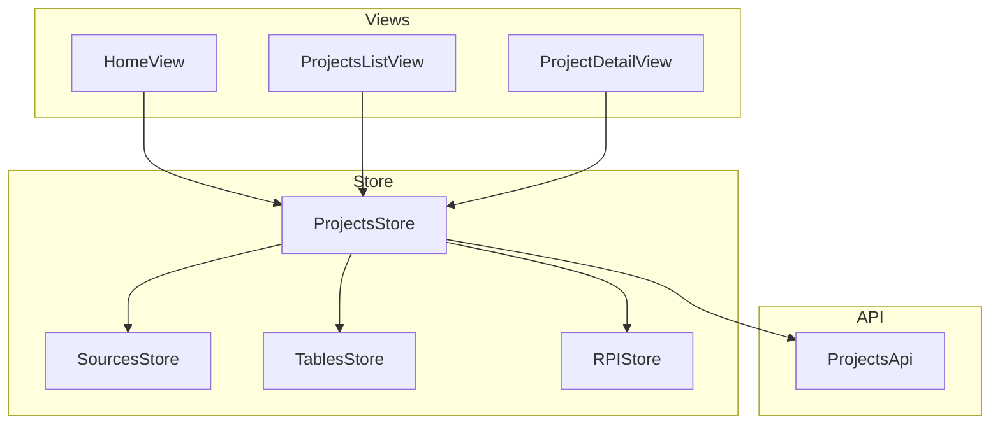

# Проекты

> Управление проектами регуляторной отчётности: CRUD, KPI-метрики, фильтрация с пагинацией, оркестрация загрузки связанных данных.

## Расположение в репозитории

- `src/api/projects.js` — API-функции: `getProjects`, `getProjectKpi`, `getRecentProjects`, `getProjectsWithFilters`, CRUD
- `src/stores/projects.js` — Pinia store: состояние проектов, KPI, пагинация, оркестрация загрузки
- `src/composables/useProject.js` — Composable: получение projectId из route, загрузка данных
- `src/views/HomeView.vue` — Dashboard с KPI-карточками
- `src/views/ProjectsListView.vue` — Список проектов с фильтрацией
- `src/views/ProjectDetailView.vue` — Детальный просмотр проекта
- `src/components/common/CreateProjectDialog.vue` — Диалог создания проекта
- `src/components/home/KpiCards.vue` — Карточки KPI
- `src/components/home/ProjectsTable.vue` — Таблица проектов
- `src/components/home/QuickActions.vue` — Быстрые действия

## Как устроено



**Проекты** — корневая сущность приложения. Содержат:
- Метаданные: name, description, status (draft/active/archived)
- Счётчики: sources, rpiRecords, approved, drafts, inReview
- Даты: created_at, updated_at

**Оркестрация загрузки**: `loadProjectData(projectId)` в проектах загружает:
1. Данные проекта (GET /projects/:id)
2. Источники (GET /projects/:id/sources) — складывает в SourcesStore
3. РПИ-маппинги (GET /projects/:id/rpi-mappings) — складывает в RPIMappingsStore
4. Таблицы маппинга для каждого источника — складывает в TablesStore

Каждый запрос выполняется независимо — ошибка в одном не блокирует загрузку остальных.

## Ключевые сущности

| Сущность | Файл | Назначение |
|----------|------|------------|
| `useProjectsStore` | `stores/projects.js:107` | Store: состояние, CRUD, KPI, пагинация |
| `loadProjects()` | `stores/projects.js:167` | Загрузка списка с фильтрами |
| `loadProjectData()` | `stores/projects.js:223` | Оркестрация загрузки всех данных проекта |
| `loadProjectKpi()` | `stores/projects.js:204` | Загрузка KPI проекта |
| `createProject()` | `stores/projects.js:313` | Создание проекта |
| `useProject()` | `composables/useProject.js:12` | Получение projectId и данных |
| `Project` | — | `{ id, name, description, status, sources, rpiRecords, ... }` |

## Как использовать / запустить

```javascript
import { useProjectsStore } from '@/stores/projects';

const store = useProjectsStore();

// Загрузка списка проектов
await store.loadProjects({ status: 'active', page: 1, size: 10 });

// Создание проекта
await store.createProject({ name: 'Новый проект', description: 'Описание' });

// Оркестрация загрузки детальных данных
await store.loadProjectData(42);
```

## Связи с другими доменами

- [sources.md](sources.md) — SourcesStore заполняется через `loadProjectData`
- [tables.md](tables.md) — TablesStore заполняется через `loadProjectData`
- [rpi-mappings.md](rpi-mappings.md) — RPIMappingsStore заполняется через `loadProjectData`
- [api.md](api.md) — использует `ProjectsApi`
- [ui.md](ui.md) — KpiCards, ProjectsTable, CreateProjectDialog

## Нюансы и ограничения

- `handleApiError` в store обрабатывает 401 через вызов `authStore.logout()` — это жёсткая связь
- KPI-данные хранятся в `Record<projectId, KPI>` (ключ-значение), а не в массиве
- Пагинация хранится отдельно: `projectPagination = { total, page, size }`
- `loadProjectData` логирует частичные ошибки через `console.warn` — мониторинг только в консоли браузера
