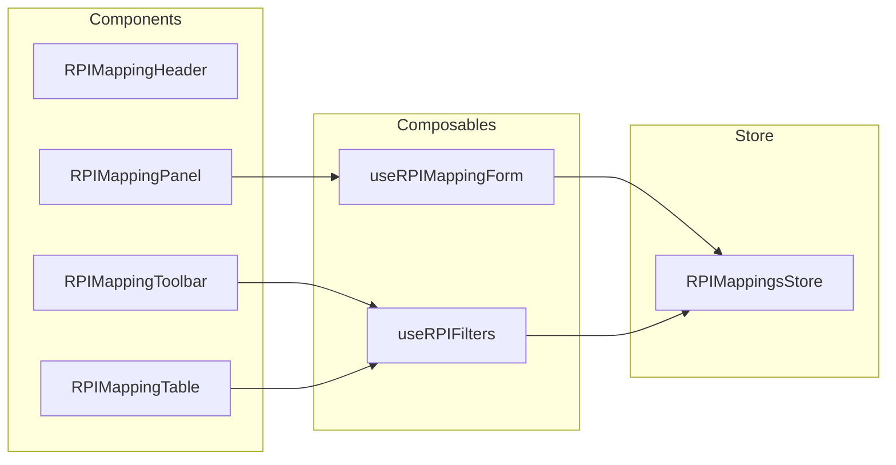

# РПИ-маппинги

> Основная бизнес-логика приложения: связь регуляторных показателей (РПИ) с колонками источников данных с полной валидацией целостности.

## Расположение в репозитории

- `src/api/projects.js` — API-функции: `getRPIMappings`, `getRPIMappingsStats`, CRUD РПИ
- `src/stores/rpiMappings.js` — Pinia store: состояние, CRUD, валидация
- `src/composables/useRPIFilters.js` — Фильтрация, поиск, пагинация
- `src/composables/useRPIMappingForm.js` — Управление формой (add/edit/delete)
- `src/views/RPIMappingView.vue` — Страница управления РПИ
- `src/components/rpi/` — Компоненты: Header, Toolbar, Table, Panel
- `src/utils/mapping.js` — Хелперы: поиск колонок, бейджи типов
- `src/constants/rpi.js` — Константы: статусы, типы, ownership, начальное состояние формы

## Как устроено



### Сущность RPIMapping

РПИ-запись представляет один регуляторный показатель или измерение со следующими ключевыми полями:

| Поле | Тип | Описание |
|------|-----|----------|
| `number` | number | Номер РПИ |
| `measurement` | string | Наименование показателя |
| `measurement_type` | string | `"dimension"` (Измерение) или `"metric"` (Метрика) |
| `object_field` | string | Поле объекта (связь с колонкой источника) |
| `source_column_id` | number\|null | Жёсткая связь с колонкой таблицы маппинга |
| `ownership` | string | Принадлежность: Аналитика, Маркетинг, Гео, Техническое |
| `status` | string | `draft` \| `review` \| `approved` |
| `is_calculated` | boolean | Расчётный показатель |
| `formula` | string\|null | Формула расчёта |

### Валидация целостности

`validateRPIMappingLink()` проверяет:
1. Существует ли `source_column_id` среди колонок проекта
2. Соответствует ли тип колонки (`metric`/`dimension`) типу РПИ
3. Совпадает ли флаг `is_calculated` у колонки и РПИ

### Фильтрация

`useRPIFilters` поддерживает:
- Поиск по тексту (measurement, description, object_field, source, comment)
- Фильтр по статусу (draft/review/approved)
- Фильтр по ownership
- Фильтр по measurement_type (metric/dimension)
- Фильтр по calculated type (basic/calculated)
- Быстрые фильтры с подсчётом
- Клиентскую и серверную пагинацию

## Ключевые сущности

| Сущность | Файл | Назначение |
|----------|------|------------|
| `useRPIMappingsStore` | `stores/rpiMappings.js:40` | Store: CRUD, валидация |
| `validateRPIMappingLink(projectId, mapping)` | `stores/rpiMappings.js:92` | Проверка целостности связи |
| `useRPIFilters(rows, options)` | `composables/useRPIFilters.js:14` | Фильтрация, поиск, пагинация |
| `useRPIMappingForm(rows, store, projectId)` | `composables/useRPIMappingForm.js:18` | Форма add/edit/delete |
| `getMappingColumnForRecord(...)` | `utils/mapping.js:32` | Поиск колонки по source_column_id |
| `createEmptyRPIForm()` | `constants/rpi.js:50` | Начальное состояние формы |

## Как использовать / запустить

```javascript
import { useRPIMappingsStore } from '@/stores/rpiMappings';
import { useRPIFilters } from '@/composables/useRPIFilters';

const rpiStore = useRPIMappingsStore();

// Загрузка РПИ-маппингов
await rpiStore.loadRPIMappings(42);

// Создание
await rpiStore.createRPIMapping(42, {
  number: 1,
  measurement: 'Выручка по месяцам',
  measurement_type: 'metric',
  object_field: 'revenue',
  ownership: 'Аналитика',
  status: 'draft',
});

// Валидация связи
const validation = rpiStore.validateRPIMappingLink(42, {
  source_column_id: 10,
  measurement_type: 'metric',
  is_calculated: false,
});
```

## Связи с другими доменами

- [tables.md](tables.md) — РПИ ссылаются на колонки таблиц через `source_column_id`; `updateColumnRPIMapping` устанавливает обратную связь
- [projects.md](projects.md) — RPIMappingsStore заполняется через `loadProjectData`
- [sources.md](sources.md) — поиск колонки требует знания source_id
- [ui.md](ui.md) — RPI-компоненты: Header, Toolbar, Table, Panel
- [api.md](api.md) — использует `ProjectsApi`

## Нюансы и ограничения

- Store хранит РПИ как `Record<projectId, RPIMapping[]>` — необходимо передавать projectId при CRUD
- Валидация связи **не блокирует** сохранение — только логирует `console.warn`
- `fillFormFromColumn` автоматически заполняет `measurement_type`, `is_calculated`, `formula` из выбранной колонки — это ключевой UX-паттерн
- Статус `"in_review"` обрабатывается наравне с `"review"` в некоторых функциях (`getMappingStatusLabel`, `getStatusPillClass`)
