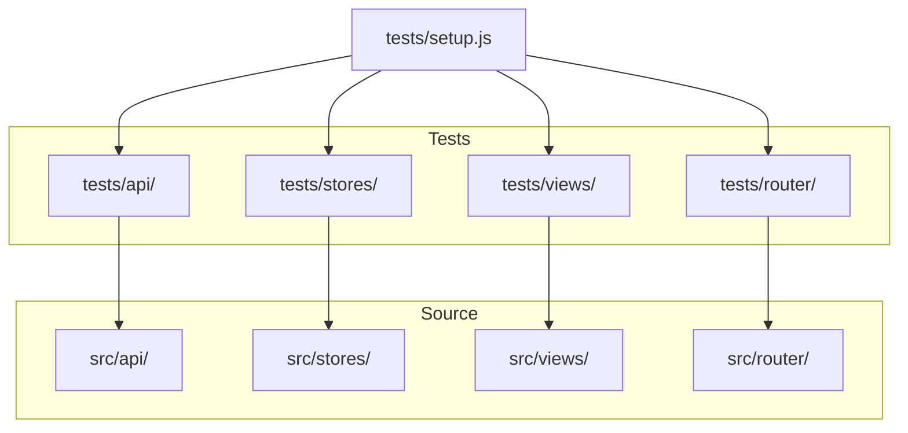

# Тестирование

> Модульные тесты с Vitest и jsdom. Структура тестов повторяет структуру src/ с разбивкой по доменам: API, stores, views, router.

## Расположение в репозитории

- `vitest.config.js` — Конфигурация Vitest
- `tests/setup.js` — Глобальный setup: Pinia, window.location mock, stubs
- `tests/api/` — Тесты API-функций
- `tests/stores/` — Тесты Pinia stores
- `tests/views/` — Тесты Vue-компонентов (views)
- `tests/router/` — Тесты роутера

## Как устроено



### Test setup

`tests/setup.js` выполняет:

1. **Pinia** — `setActivePinia(createPinia())` в каждом `beforeEach`
2. **window.location mock** — для тестов редиректов (logout → /login)
3. **Vue Test Utils config** — глобальные stubs для `router-link` и `router-view`
4. **cleanup** — `vi.clearAllMocks()` в `afterEach`

### Структура тестов

| Файл | Тестируемый модуль | Что проверяет |
|------|-------------------|---------------|
| `api/auth.spec.js` | `src/api/auth.js` | login/register/getMe/logout API вызовы |
| `api/client.spec.js` | `src/api/client.js` | Axios client, interceptors, ApiError |
| `api/projects.spec.js` | `src/api/projects.js` | API функции проектов и РПИ |
| `api/layerMapping.spec.js` | `src/api/layerMapping.js` | API функции DWH-слоёв |
| `stores/auth.spec.js` | `src/stores/auth.js` | Auth store: login/logout/loadUser |
| `stores/layerMapping.spec.js` | `src/stores/layerMapping.js` | Layer mapping store: CRUD, lineage |
| `views/LoginView.spec.js` | `src/views/LoginView.vue` | Страница логина: форма, ошибки, редиректы |
| `views/RegisterView.spec.js` | `src/views/RegisterView.vue` | Страница регистрации: форма, авто-логин |
| `views/LayerMappingView.spec.js` | `src/views/LayerMappingView.vue` | Страница маппинга слоёв |
| `router/index.spec.js` | `src/router/index.js` | Route guards, редиректы, защита маршрутов |

## Ключевые сущности

| Сущность | Файл | Назначение |
|----------|------|------------|
| `vitest.config.js` | — | Конфигурация Vitest |
| `tests/setup.js` | — | Глобальный setup для всех тестов |
| `flushPromises()` | `tests/setup.js:29` | Хелпер для ожидания выполнения промисов |

## Как использовать / запустить

```bash
# Запуск всех тестов (однократно)
npm run test:run

# Запуск в watch-режиме
npm run test

# Запуск с UI
npm run test:ui

# Запуск с coverage
npm run coverage

# Запуск конкретного теста
npx vitest run tests/api/auth.spec.js
```

## Связи с другими доменами

- [config.md](config.md) — Vitest конфигурация (jsdom, globals, setupFiles, coverage)
- [api.md](api.md) — тесты API-функций
- [auth.md](auth.md) — тесты auth store и login/register views
- [layer-mapping.md](layer-mapping.md) — тесты layer mapping API, store, view
- [ui.md](ui.md) — тесты views используют stubs для router-link/router-view

## Нюансы и ограничения

- Только Vitest с jsdom — нет e2e-тестов (Cypress/Playwright)
- Тесты покрывают не все домены: нет тестов для sources store, tables store, rpiMappings store, projects store (хотя их API функции тестируются), workflow store
- Нет тестов для composables (`useRPIFilters`, `useRPIMappingForm`, `useLayerMappingCanvas`)
- Нет тестов для утилит (`format.js`, `mapping.js`, `status.js`, `layerMapping.js` — хотя последний косвенно покрыт через layerMapping tests)
- `deps.inline: [/vue-router/, /pinia/]` в vitest.config.js — форсирует инлайн для корректной работы тестов
