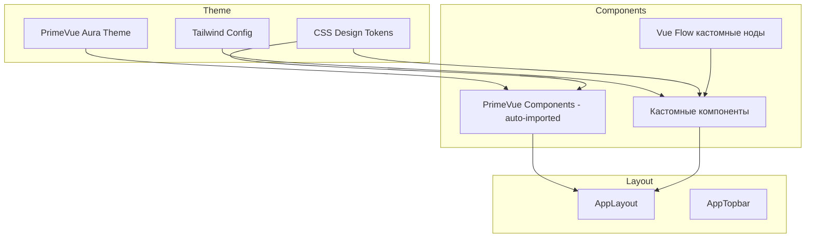

# UI-компоненты и стилизация

> Компонентная архитектура приложения, layout, PrimeVue-темизация, Tailwind CSS-токены, стилизация кастомных Vue Flow нод.

## Расположение в репозитории

- `src/App.vue` — Корневой компонент
- `src/main.js` — Инициализация PrimeVue, DialogService, ToastService
- `src/layout/AppLayout.vue` — Основной layout
- `src/layout/AppTopbar.vue` — Верхняя панель навигации
- `src/assets/main.css` — Глобальные стили, CSS-переменные, design tokens
- `tailwind.config.js` — Tailwind-конфигурация с кастомными цветами
- `src/components/` — Все компоненты по доменам
- `index.html` — HTML entry (lang="ru", PrimeIcons CDN)

## Как устроено

### Дизайн-система



**Стилизация построена на трёх уровнях:**

1. **PrimeVue Aura Theme** — глобальная тема через `@primeuix/themes`. Установлен `darkModeSelector: ".p-dark"`.
2. **Tailwind CSS с кастомными токенами** — цвета определённые в `tailwind.config.js` используют CSS-переменные (`var(--app-*)`), что позволяет менять тему на лету.
3. **CSS-переменные в main.css** — все design tokens: `--app-bg`, `--app-surface`, `--app-primary`, `--app-success`, `--app-warning`, `--app-error`, `--app-info` и их вариации.

### Кастомные цвета

| Категория | Основные переменные |
|-----------|-------------------|
| Фон | `--app-bg`, `--app-surface`, `--app-surface-hover`, `--app-surface-active` |
| Текст | `--app-text`, `--app-text-secondary`, `--app-text-muted`, `--app-text-faint` |
| Границы | `--app-border`, `--app-border-hover`, `--app-divider` |
| Primary | `--app-primary`, `--app-primary-hover`, `--app-primary-light`, `--app-primary-text` |
| Семантика | `--app-success`, `--app-warning`, `--app-error`, `--app-info` (+ bg, border, text) |
| Графики | `--chart-1` через `--chart-5` |

### Компонентная архитектура

**Типы компонентов:**

- **Общие (common)**: ApiStatusIndicator, Create*Dialog — переиспользуемые диалоги и индикаторы
- **Домашние (home)**: KpiCards, ProjectsTable, QuickActions — dashboard
- **Layer Mapping**: ERTableNode (кастомная Vue Flow нода), FullLineageCanvas, SingleMappingCanvas, TransformationModal, CreateDWHTableDialog, LayerMappingToolbar
- **RPI**: RPIMappingHeader, RPIMappingPanel (side panel), RPIMappingTable, RPIMappingToolbar
- **Workflow**: StepIndicator
- **Layout**: AppLayout, AppTopbar

**Паттерны UI:**
- **Dialog Pattern** — модальные окна для create/edit (PrimeVue Dialog)
- **Side Panel Pattern** — выдвижная панель для inline-редактирования (RPIMappingPanel)
- **Accordion Pattern** — вложенные секции для иерархии проект→источник→таблица→колонки
- **Canvas Pattern** — Vue Flow canvas для визуализации графов lineage

### Auto-import компонентов

PrimeVue-компоненты автоматически импортируются через `unplugin-vue-components` с `PrimeVueResolver` — не требуется ручной импорт Button, Dialog, InputText и т.д.

## Ключевые сущности

| Сущность | Файл | Назначение |
|----------|------|------------|
| `AppLayout` | `layout/AppLayout.vue` | Основной layout с topbar и роутером |
| `AppTopbar` | `layout/AppTopbar.vue` | Навигация, имя пользователя, logout |
| `ERTableNode` | `components/layerMapping/ERTableNode.vue` | Кастомная Vue Flow нода |
| `main.css` | `assets/main.css` | CSS design tokens |
| `tailwind.config.js` | — | Кастомная цветовая палитра |
| `index.html` | — | HTML entry, PrimeIcons CDN |

## Как использовать / запустить

```vue
<!-- Пример использования кастомной цветовой схемы -->
<div class="bg-app-surface text-app-text border border-app-border rounded-lg p-4">
  <p class="text-app-text-secondary">Secondary text</p>
  <Badge severity="success" value="Активный" />
</div>
```

## Связи с другими доменами

- [auth.md](auth.md) — AppTopbar использует authStore для отображения пользователя
- [layer-mapping.md](layer-mapping.md) — ERTableNode, FullLineageCanvas, SingleMappingCanvas
- [rpi-mappings.md](rpi-mappings.md) — RPIMappingPanel, RPIMappingTable, RPIMappingToolbar
- [projects.md](projects.md) — KpiCards, ProjectsTable, CreateProjectDialog
- [config.md](config.md) — Tailwind, PostCSS, PrimeVue auto-import конфигурация

## Нюансы и ограничения

- Dark mode переключается через класс `.p-dark` на html-элементе — все CSS-переменные переопределяются через `:root.p-dark`
- PrimeIcons подключены через CDN (`unpkg.com`) — при недоступности CDN иконки не отобразятся
- Sidebar состояние сохраняется в localStorage (`sidebarVisible`)
- Нет адаптивного layout для мобильных устройств — минимальная ширина ~1024px
- ERTableNode — единственная кастомная Vue Flow нода; стилизация не стандартизирована
- Auto-import PrimeVue компонентов может конфликтовать с ручным импортом в некоторых случаях
