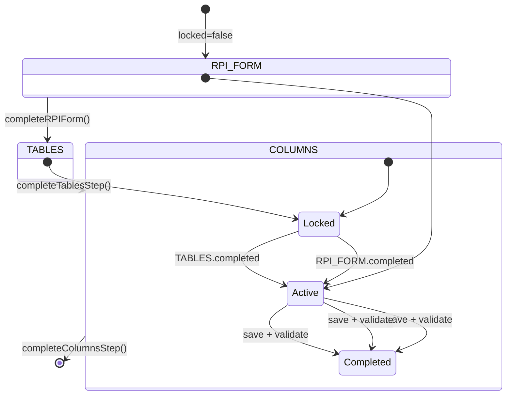

# Воркфлоу процесса

> Пошаговый процесс создания РПИ: от заполнения формы до настройки колонок, с блокировкой шагов и сохранением состояния в localStorage.

## Расположение в репозитории

- `src/stores/workflow.js` — Pinia store: состояние, шаги, валидация, localStorage persistence
- `src/constants/workflow.js` — Константы: шаги, статусы, типы колонок
- `src/components/workflow/StepIndicator.vue` — Визуальный индикатор шагов

## Как устроено

### Шаги процесса



Каждый шаг имеет один из статусов:
- `locked` — заблокирован (недоступен)
- `active` — активен (текущий шаг)
- `completed` — завершён

### Валидация и блокировка

**Бизнес-правила:**
1. Шаг РПИ формы требует обязательное поле `name`
2. Шаг таблиц требует завершённый RPI_FORM и хотя бы одну таблицу
3. Шаг колонок требует завершённые RPI_FORM и TABLES
4. Предотвращение повторных отправок через флаг `isSubmitting`
5. После завершения шага RPI_FORM проект разблокируется (`isProjectLocked = false`)

### Персистентность

Состояние workflow сохраняется в localStorage под ключом `workflow_{projectId}`. Это позволяет:
- Восстанавливать прогресс после перезагрузки страницы
- Продолжать процесс с того же шага
- Сбрасывать состояние через `resetWorkflow()`

## Ключевые сущности

| Сущность | Файл | Назначение |
|----------|------|------------|
| `useWorkflowStore` | `stores/workflow.js:89` | Store: состояние, шаги, валидация |
| `WORKFLOW_STEPS` | `constants/workflow.js:7` | `{ RPI_FORM, TABLES, COLUMNS }` |
| `STEP_ORDER` | `constants/workflow.js:14` | Порядок шагов |
| `STEP_STATUS` | `constants/workflow.js:21` | `{ LOCKED, ACTIVE, COMPLETED }` |
| `completeRPIForm(projectId, rpiData)` | `stores/workflow.js:202` | Завершить шаг 1 |
| `completeTablesStep(projectId, tablesData)` | `stores/workflow.js:266` | Завершить шаг 2 |
| `completeColumnsStep(projectId, columnsData)` | `stores/workflow.js:318` | Завершить шаг 3 |
| `resetWorkflow(projectId)` | `stores/workflow.js:352` | Сбросить прогресс |
| `COLUMN_TYPES` | `constants/workflow.js:28` | `{ METRIC, DIMENSION }` |
| `StepIndicator` | `components/workflow/StepIndicator.vue` | Визуальный индикатор |

## Как использовать / запустить

```javascript
import { useWorkflowStore } from '@/stores/workflow';

const workflowStore = useWorkflowStore();

// Завершить шаг РПИ формы
const success = workflowStore.completeRPIForm(42, {
  name: 'Отчёт по выручке',
  // ... другие данные
});
if (success) {
  // Шаг 1 завершён, TABLES теперь активен
}

// Проверить статус проекта
const isUnlocked = workflowStore.isProjectUnlocked(42);

// Сбросить прогресс
workflowStore.resetWorkflow(42);
```

## Связи с другими доменами

- [rpi-mappings.md](rpi-mappings.md) — RPI_FORM шаг связан с созданием РПИ
- [tables.md](tables.md) — TABLES шаг связан с созданием таблиц маппинга
- [ui.md](ui.md) — StepIndicator.vue отображает прогресс в UI

## Нюансы и ограничения

- `completeRPIForm` содержит имитацию асинхронного сохранения (`Date.now()` для ID) — в реальности будет API-вызов
- Состояние хранится в localStorage — не подходит для multi-tab сценариев без синхронизации
- `isSubmitting` не блокирует на уровне API (только на уровне UI) — нет защиты от двойного клика
- Константы `COLUMN_TYPES`, `COLUMN_TYPE_LABELS`, `COLUMN_TYPE_COLORS` реэкспортируются из workflow store для обратной совместимости
